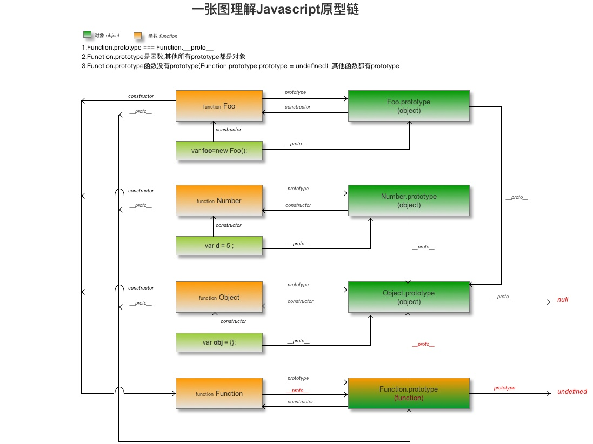

## 函数'对象'

<b class="update-time">{{1542099017101 | formatTime}}</b><b class='type'>js</b>
<b class='kw'>axios实现</b> <b class='kw'>apply实现</b> <b class='kw'>bind实现</b>

> 从一道面试题说起
实现一个 add 方法，如 add(1)(2)(3)(4).getValue() // 返回相加结果

如果用过 axios，也会发现起 api 设计的神奇之处，调用风格如下：

```js
axios(config)
axios.defaults.headers.common['xx'] = 'yy'
const instance = axios.create(config)
instance(config)
...
```

如果只是使用到不觉奇怪，但是仔细看了一下，不对啊。这 axios 到底是函数还是对象？还能继承？！  
谁说函数就不是对象了？  

是时候复习一下原型相关的知识了  

<details open="true">

<summary><b>一张图了解 prototype constructor __proto__ </b></summary>



</details>

**总结：**  

1. 所有函数的构造函数都是 Function，包括它自己
2. 所有普通对象、所有函数的原型都继承自 Object.prototype，包括 Function.prototype
3. 所有函数都继承自 Function.prototype (它其实也是一个 function)
4. Object.prototype （你丫不也是一个对象吗？）继承自 null
5. Function.prototype （你丫不也是一个函数吗？）的原型是 undefined

> 不是有那么一句话嘛，一切皆对象。所以函数也是对象啊

### 回到第一题

好的，我们先回到第一个题目，实现 `add(1)(2)(3).getValue()`。

#### add方法分析

乍一看像极了柯里化，可是是柯里化吗？不是啊，因为不确定嵌套几层，但是方向是对的，返回了一个函数  
但是还可以调用 getValue 而且存了一个值。这个简单，函数不也是对象吗？那我就给你加上这些属性呗，然后把你给返回出去

#### add方法实现

```js
'use strict';
function add (v = 0) {
  add.value += v;
  return add; // 这里就不要 arguments.callee 了
}
add.value = 0;
add.getValue = function () {
  return add.value;
}

add(1)(2)(3).getValue();
```

### axios实现

> axios 在设置 defaults 前 instance 就被 create，defaults 并不会添加到 instance 配置项中。instance 没有 create 方法
那我们来个更复杂的 父 axios 在 子 axios 创建后 设置 defaults，在 axios 调用其请求方法，仍其作用，子 axios 还有 create 方法

#### 分析

现在思路应该清晰一点了吧？

1. axios 是一个函数，假设有一个 Axios 类，这个函数就是 Axios 类的 request 方法
2. axios 拥有 Axios 实例的所有方法，axios.create 返回的 子 axios “继承自” axios 的 Axios 实例
3. 类似原型链 axios 在获取 config 时会沿着 “原型链” 向上查找

当然实际操作并不是这样的

1. 有一个 Axios 类，并暴露一定方法，可以让 axios 获得
2. 创建 axios 时，先传入 parent ，实例化一个 Axios 对象，setchild，将其所有 key 绑定到 axios 上并将 this 指向 Axios 实例
3. 关于设置 defaults 有两种方案 1）代理其 get 与 set，在 get 时延 parent 递归合并配置； 2）更改 defaults 时告知每一个 child，child 来生成新的 config

个人比较倾向第二种方案。方案 2 虽然比较节省内存也方便管理（不需要拷贝默认值，父级更改不影响子级）。但是场景是 get 操作会比较频繁， set 操作比较少，而且 config 不是一个巨大的对象

#### 实现

> 由于发送请求大致差不多，获取配置、xhr 函数在此省略

```js
// extends 实现
function AxiosFactory(config, target) {
  const axios = target ? target.create(config) : new Axios(config, parent)
  const result = axios.request
  for (let key in axios) {
    if (typeof axios[key] === 'function') {
      result[key] = axios[key].bind(axios)
    }
  }
  result.create = function(conf) {
    return AxiosFactory(conf, axios)
  }
  return result
}

const axios = AxiosFactory({})

export default axios

```

```js
// Axios.js
function decorator(conf = {enumerable: true}) {
  return function(target, name, descriptor) {
    return Object.assign({}, descriptor, conf)
  }
}

class Axios {
  parent = null
  children = []
  config = {}
  constructor(conf) {
    this.config = conf;
    this.interceptors = {
      request: xx,
      response: xx
    }
  }
  @decorator()
  create(conf) {
    const axios = new Axios(conf);
    axios.parent = this;
    this.children.push(axios);
    return axios;
  }
  @decorator()
  request() {}
}

```

整体来说关键在于工厂函数里将 axios 所有方法调用者指向 Axios实例。整个设计看起来像是隐藏 Axios 实例，从而保证了 Axios 实例 更加安全。  
比如开发者如果去观察 axios，除了 ‘原型方法’ 可以没有任何 ‘实例属性’(这里暴露了 interceptors)，如果开发者贸然手动更改 ‘实例属性’ 可能使得代码不能运行

### 一些思考

正如上面所说，我们只暴露应该可以被开发者访问的属性或者方法，其实就是代理模式。举个例子，比如我们想实现 Promise 垫片。我们知道 Promise 实例并没有 state task value 这些，而是一个单纯的对象，有个 then 方法还是原型上的，所以我们可以通过代理把内部维护的 PromiseStatus PromiseValue ‘隐藏’ ，当然这还是不优雅，有没有更好的方案？  
假设我们封装了一个构造器函数，我们希望实例有一些内部维护的数据，但是不希望开发者去访问和使用，如果是模块化比较好办，但很多模块化方案就是闭包啊

```js
(function () {
  const CacheData = {} // 存放实例 id 和 data
  let lastId = 0
  function A() {
    this.id = lastId++;
    CacheData[this.id] = {}
  }

  function.prototype.b = function(v) {
    CacheData[this.id].c = v
  }
  window.A = A
})()
```

这样只暴露了 id 给开发者，而开发者却访问不到 id 对应的 ‘内部数据’  
假设我们需要实现一个类，这个类内部做了一些数据缓存

1. 一种方式是通过一个工厂函数返回一个类实例的代理对象，但这种方式首先是 new 显得无意义，另一方面是每次创建代理还需要进行一次拷贝（虽然拷贝的是引用）
2. 只是暴露一个 id，但是 使用者无法访问 id 对应的数据，当然这种方式也有坏处，当实例被销毁时对应的数据无法感知，可能导致内存泄漏，或者说不必要的内存使用

方案1 比较适合暴露的类由开发者自己使用，可以随意销毁。方案2 比较适合新的类来控制，比如提供生命周期，通过 destroy 来销毁（比如实现一个 MVVM 框架）

另外 函数对象其实还挺有意思的，函数还可以像对象一样。细思极恐的事来了，我们知道 Function.prototype (嗯，按道理它是一个对象，对，它继承自 Object.prototype)，可它还偏偏还可以被调用 callable
